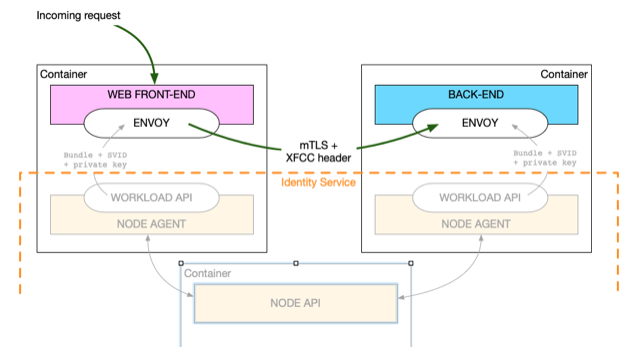
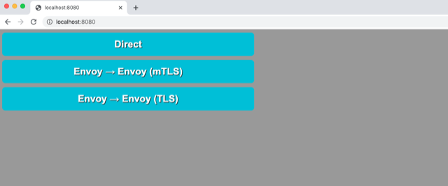
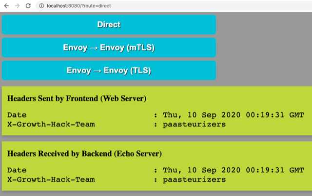
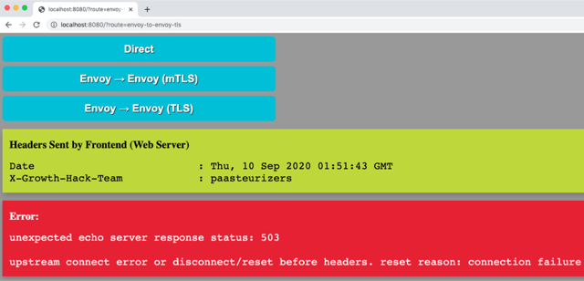
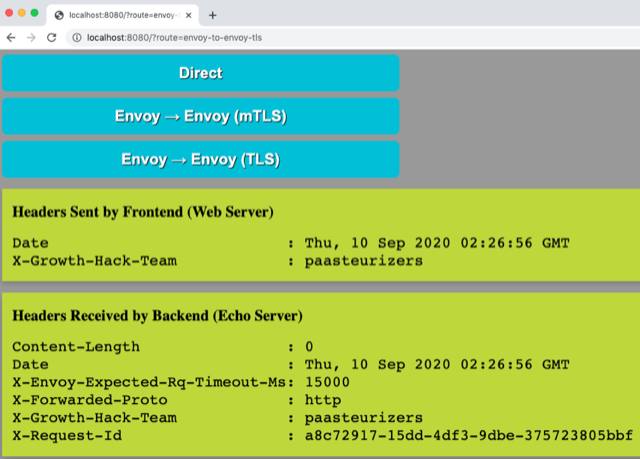
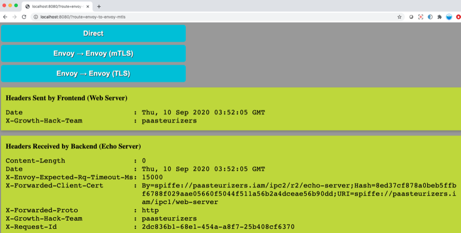

# Growth-hack: Workload integration, Envoy SDS, TLs/mTLS, Zero trust network (mTLS), XFCC header, L4 filtering , L7 policies

In this demo we show that integrating with our identity framework does not require any application code change, this is possible thank to the use of envoy proxies with dynamic secret management through SDS.
For the demo we will go through the following steps:
1. Deploy empty nodes with docker-compose
2. Start an application with a web frontend and a dummy backend
3. Connect to the newly deployed application and validate its proper working without identities
After this we will
4. Deploy our identity service (agents), on the nodes where the frontend and backend applications are running
5. Given an identity to the backend and without any code change, establish a TLS connection between frontend and backend
6. Give an identity to the fronend and without any code change, establish a mTLS connetion between frontend and backend
If time permit, we will cover
7. How identity and refresh of that identity can be managed
8. What are the benefit of a mTLS-based, zero trust network
9. Discuss possible extensions to our identity service, such as a trusted metadata store, proxy WASM, and OPA

Let's get started!

## Experiment overview



Requirements

```bash
brew install docker
brew install docker-compose
docker-compose --version
# docker-compose version 1.26.2, build eefe0d31
```

## Deployment of workloads AS-IS, NO IDENTITIES

Let's deploy an empty infrastructure.
We are starting 3 containers here.
But you can imagine that those containers are virtual machines, running on TIMS (VMware infrastructure) 

```bash
cd ./src
docker-compose up -d
# Recreating src_spire-server_1 ... done               <== Now ew start 3 containers, the identity service ...
# Recreating src_backend_1      ... done               ... the (empty) node for the backend application workload,
# Recreating src_frontend_1     ... done               ... and the i(empty) node for frontend application workload
```

Start the workloads

```
# In the FRONTEND node, let's start our web-server
docker-compose exec -d frontend web-server -log /opt/spire/web-server.log

# In the BACKEND node, let's start a dummy backend service (an echo server)
docker-compose exec -d backend  echo-server -log /opt/spire/echo-server.log
```

Now the workloads have been deployed as is, let's check that the direct connection Frontend-to-Backend works.
Got to the following URL: <http://localhost:8080>



... and click in the button labelled 'direct connection'



By connecting to the website, you are actually connecting to the frontend.
Additionally what you see is how the front-end communicate with the backend.
In particular, what headers the frontend is sending to the backend, and what headers the backend is receiving.

## Deployment of our identity service 

The identity service (i.e server) has been already deployed by the 'docker-compose' up command.
To add the frontend and backend nodes in our trust domain, we need to start agents on them.
So now,let's start those agents

```bash
# First the one on the front-end
docker-compose exec -T spire-server bin/spire-server bundle show | docker-compose exec -T frontend tee conf/agent/bootstrap.crt > /dev/null
docker-compose exec -d frontend bin/spire-agent run

# Second the one in the second-end
docker-compose exec -T spire-server bin/spire-server bundle show | docker-compose exec -T backend tee conf/agent/bootstrap.crt > /dev/null
docker-compose exec -d backend bin/spire-agent run
```

Note that the first of the 2 commands above is for the attestation of the agent.
The bootstrap certificate that is uploaded by the server is used to authenticate the 


## Deployment of the envoy proxies

In addition to our identity service, we will deploy local proxies which will be managing identities on the bahalf of the applications.

Let's deploy envoy proxies, one in the frontend and one in the backend., one in each node.

```bash
docker-compose exec -d backend /usr/local/bin/envoy -l debug -c /etc/envoy/envoy.yaml --log-path /opt/spire/envoy.log

docker-compose exec -d frontend /usr/local/bin/envoy -l debug -c /etc/envoy/envoy.yaml --log-path /opt/spire/envoy.log
```

At this point, the envoy proxies have been deployed, but cannot fetch an identity from our identity service.
Let's change that.

## TLS to the backend application

We are now going to give an identity to the backend application.
Let's first try to connect the frontend and backend using TLS (https) with a certificate/identity on the backend.
At this time, this should fail because no identity profile has been created.

To check the TLS connection, go to the following URL <http://localhost:8080/?route=envoy-to-envoy-tls>



Let's change that now, by creating a profile for the backend application.

Although not shown, we have configured the server (and agents) to be able to attest each other based on the x509pop algorithm.
The agent profiling is done with the following 'fingerprinting' algorithm:

```bash
fingerprint() {
	# calculate the SHA1 digest of the DER bytes of the certificate using the
	# "coreutils" output format (`-r`) to provide uniform output from
	# `openssl sha1` on macOS and linux.
	cat $1 | openssl x509 -outform DER | openssl sha1 -r | awk '{print $1}'
}
```

Let's now create a profile for the backend application/workload, aka echo-server.

```
cd ./src
BACKEND_AGENT_FINGERPRINT=$(fingerprint backend/etc/agent.crt.pem); echo ${BACKEND_AGENT_FINGERPRINT}
# 98baf916dad9eaf3cbc3b4f7c725ba8113f84c8a

docker-compose exec spire-server bin/spire-server entry create \
	-parentID spiffe://paasteurizers.iam/spire/agent/x509pop/${BACKEND_AGENT_FINGERPRINT} \
	-spiffeID spiffe://paasteurizers.iam/ipc2/r2/echo-server\
	-selector unix:user:root
# Entry ID      : aee0fe67-c332-4ed8-971a-84f6c1468ab0
# SPIFFE ID     : spiffe://paasteurizers.iam/ipc2/r2/echo-server
# Parent ID     : spiffe://paasteurizers.iam/spire/agent/x509pop/98baf916dad9eaf3cbc3b4f7c725ba8113f84c8a
# TTL           : 3600
# Selector      : unix:user:root
```

Essentially, the docker-compose command above creates a workload profile, which reads as follow:
"Any workload that contact the agent identified as 'spiffe://paasteurizers.iam/spire/agent/x509pop98baf916dad9eaf3cbc3b4f7c725ba8113f84c8a' using a unix socket (i.e running on the same host) with a user id of root (root is the user than runs envoy in the container) will get the spiffe ID 'spiffe://paasteurizers.iam/ipc2/r2/echo-server"'

When this workload profile is created, envoy will immediately get the 'spiffe://paasteurizers.iam/ipc2/r2/echo-server' ID.

Let's now check whether the TLS connection works... <http://localhost:8080/?route=envoy-to-envoy-tls>



Hourray!

Now let's give an identity to the frontend, our web-server.

When using certificates on the frontend/client and the backend/server side, we will be using a client TLS to server TLS connection also known as mutual TLS, or mTLS.

## mTLS connection between frontend and backend

Now let's give an identity to the frontend service.
First let's try a mTLS connection without giving an identity to the frontend/web-server.
To do that, go to following url <http://localhost:8080/?route=envoy-to-envoy-mtls>


Now let's profile the front-end service ...

```bash
cd ./src
FRONTEND_AGENT_FINGERPRINT=$(fingerprint frontend/etc/agent.crt.pem); echo ${FRONTEND_AGENT_FINGERPRINT}
# 2963802ba4938e8a10180b7782d29c58e7282423

docker-compose exec spire-server bin/spire-server entry create \
	-parentID spiffe://paasteurizers.iam/spire/agent/x509pop/${FRONTEND_AGENT_FINGERPRINT} \
	-spiffeID spiffe://paasteurizers.iam/ipc1/web-server \
	-selector unix:user:root
# Entry ID      : 12b5d1fd-e018-4465-aa93-4146fc02808c
# SPIFFE ID     : spiffe://paasteurizers.iam/ipc1/web-server
# Parent ID     : spiffe://paasteurizers.iam/spire/agent/x509pop/2963802ba4938e8a10180b7782d29c58e7282423
# TTL           : 3600
# Selector      : unix:user:root
```

Note that the profile is very similar to the one given to the backend application.
The major difference though is that the identity request will be done though an agent running in a different node.

Let's now validate the mTLS connection by going to following url <http://localhost:8080/?route=envoy-to-envoy-mtls>



Hurray, we now have the beginning of a zero-trust network, where the client and server applications do not trust each others, but check the identity of one another before establishing a connection.

BEST OF ALL, WE HAVE DONE THIS WITHOUT CHANGING A SINGLE LINE OF CODE IN THE ORIGINAL APPLICATIONS !!!

BEWARE: notice the X-Forward-Client-CERt (XFCC) header which is automatically added by envoy and which escalate certificate information (TCP Layer 4) to the application layer (HTTPS Layer 7).
After the TCP connection is established between the frontend and backend, that header can be used for policy filtering.

## Extensions

If you are interested in discussion related to :
* trusted Meta data storage - < >
* policy integration with OPA or the likes - <https://stash>
* proxy WASM filters - <https://stash>

Well, for more information, contact a member of the paasteurizers team ;-)

## Conclusion

In this demo, we showed

1. How two workloads on different nodes can communicate with each others
  * with no identities
  * with an identity on the backend and using TLS
  * with an identity on the frontend and backend using mTLS

2. We also briefly touch on those topics
  * how envoy with its SDS API is used to fetch and refresh (identity) certificates
  * how mTLS relates to a zero trust network
  * how a zero trust network has no perimeter and is more secure than a perimeter DMZ-based network
  * how a trusted metadata store can be used to extend authorization policies
  * how WASM filters can be built in proxies to apply the authorization policies 

The key point of this demo, though, is to show that the proposed identity management can be used by existing workloads without changing a single line of code!
  
Enjoy! 
